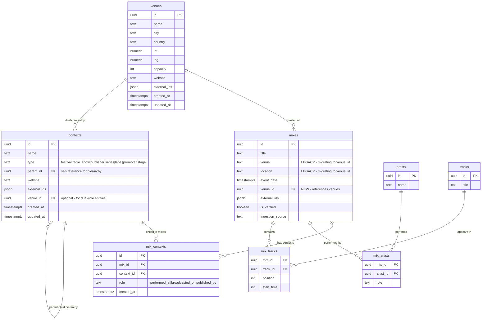

# Contexts & Venues Schema ✅ DEPLOYED

This document describes the enhanced schema for modeling mix contexts (festivals, radio shows, publishers) and venues in the mixd.fm ingestion system.

**Status**: ✅ **LIVE** - Migration deployed to production on 2025-08-03

## Overview

The schema extension adds three new tables to support rich context modeling:
- **`venues`** - Physical locations, stages, and event spaces
- **`contexts`** - Cultural contexts like festivals, radio shows, publishers with hierarchical support
- **`mix_contexts`** - Many-to-many relationships between mixes and contexts with role specification

## Schema Design

### Entity Relationship Diagram



## Table Definitions

### venues
Physical locations, stages, and event spaces.

```sql
CREATE TABLE venues (
  id UUID PRIMARY KEY DEFAULT gen_random_uuid(),
  name TEXT NOT NULL,
  city TEXT,
  country TEXT,
  lat NUMERIC,  -- latitude for geolocation
  lng NUMERIC,  -- longitude for geolocation
  capacity INTEGER,
  website TEXT,
  external_ids JSONB DEFAULT '{}',  -- {"maps": "gmaps:ChIJ...", "facebook": "fb:..."}
  created_at TIMESTAMPTZ DEFAULT NOW(),
  updated_at TIMESTAMPTZ DEFAULT NOW()
);
```

### contexts
Cultural contexts with hierarchical support.

```sql
CREATE TABLE contexts (
  id UUID PRIMARY KEY DEFAULT gen_random_uuid(),
  name TEXT NOT NULL,
  type TEXT NOT NULL CHECK (type IN ('festival', 'radio_show', 'publisher', 'series', 'label', 'promoter', 'stage')),
  parent_id UUID REFERENCES contexts(id) ON DELETE SET NULL,  -- for hierarchies
  website TEXT,
  external_ids JSONB DEFAULT '{}',  -- {"youtube": "yt:...", "soundcloud": "sc:..."}
  venue_id UUID REFERENCES venues(id) ON DELETE SET NULL,  -- for dual-role entities
  created_at TIMESTAMPTZ DEFAULT NOW(),
  updated_at TIMESTAMPTZ DEFAULT NOW()
);
```

### mix_contexts
Many-to-many join table with role specification.

```sql
CREATE TABLE mix_contexts (
  id UUID PRIMARY KEY DEFAULT gen_random_uuid(),
  mix_id UUID NOT NULL REFERENCES mixes(id) ON DELETE CASCADE,
  context_id UUID NOT NULL REFERENCES contexts(id) ON DELETE CASCADE,
  role TEXT NOT NULL CHECK (role IN ('performed_at', 'broadcasted_on', 'published_by')),
  created_at TIMESTAMPTZ DEFAULT NOW(),
  
  UNIQUE(mix_id, context_id, role)
);
```

## Context Hierarchies

### Festival Hierarchy Example
```
Tomorrowland (festival)
├── Tomorrowland 2024 (festival)
│   ├── Weekend 1 (festival)
│   └── Weekend 2 (festival)
└── Tomorrowland 2025 (festival)
    ├── Weekend 1 (festival)
    └── Weekend 2 (festival)
```

### Radio Show Hierarchy Example
```
BBC Radio 1 (publisher)
├── Essential Mix (radio_show)
├── Diplo & Friends (radio_show)
└── Future Sounds (radio_show)
```

### Label Series Hierarchy Example
```
Anjunadeep (publisher)
├── Anjunadeep Explorations (series)
├── Anjunadeep Edition (series)
└── The Anjunadeep Edition (series)
```

## Dual-Role Entities

Some entities function as both venues and publishers/contexts:

**Example: Printworks London**
- **As Venue**: `venues` table with location, capacity, geo data
- **As Publisher**: `contexts` table with `type='publisher'` and `venue_id` linking back to the venue

```sql
-- Venue record
INSERT INTO venues (name, city, country, capacity) 
VALUES ('Printworks London', 'London', 'UK', 2500);

-- Context record (references the venue)
INSERT INTO contexts (name, type, venue_id) 
VALUES ('Printworks', 'publisher', [venue_id_from_above]);
```

## External IDs Format

All external IDs use namespaced JSON format:

```json
{
  "youtube": "yt:UCGBAsFXa8TP60B4d2CGet0w",
  "soundcloud": "sc:cerclemusic",
  "1001": "1001:123456",
  "maps": "gmaps:ChIJN1t_tDeuEmsRUsoyG83frXM",
  "spotify": "spotify:show:4rOoJ6Egrf8K2IrywzwOMk",
  "facebook": "fb:printworkslondon",
  "instagram": "ig:printworkslondon"
}
```

## Role Definitions

### performed_at
The mix was performed at this context/venue.
- Festival stages, club nights, venue performances

### broadcasted_on
The mix was broadcast or streamed by this context.
- Radio shows, podcast series, streaming platforms

### published_by
The mix was published/released by this context.
- Record labels, media companies, event promoters

## Example Data Models

### Example: Cercle Mix at Château de Fontainebleau

```sql
-- Venue
INSERT INTO venues (name, city, country, external_ids) VALUES 
('Château de Fontainebleau', 'Fontainebleau', 'France', '{"maps": "gmaps:ChIJN1t_tDeuEmsRUsoyG83frXM"}');

-- Context (Cercle as publisher)
INSERT INTO contexts (name, type, external_ids) VALUES 
('Cercle', 'publisher', '{"youtube": "yt:UCPKT_csvP72boVX0XrMtagQ", "soundcloud": "sc:cerclemusic"}');

-- Mix relationships
INSERT INTO mix_contexts (mix_id, context_id, role) VALUES 
([mix_id], [cercle_context_id], 'published_by');

-- Link mix to venue
UPDATE mixes SET venue_id = [venue_id] WHERE id = [mix_id];
```

### Example: Essential Mix Episode

```sql
-- BBC Radio 1 as publisher
INSERT INTO contexts (name, type, external_ids) VALUES 
('BBC Radio 1', 'publisher', '{"website": "bbc.co.uk/radio1"}');

-- Essential Mix as radio show (child of BBC Radio 1)
INSERT INTO contexts (name, type, parent_id) VALUES 
('Essential Mix', 'radio_show', [bbc_radio1_id]);

-- Link mix to Essential Mix
INSERT INTO mix_contexts (mix_id, context_id, role) VALUES 
([mix_id], [essential_mix_id], 'broadcasted_on');
```

## Performance Indexes

```sql
-- Context lookups
CREATE INDEX idx_contexts_type ON contexts(type);
CREATE INDEX idx_contexts_parent_id ON contexts(parent_id);

-- Mix-context relationships  
CREATE INDEX idx_mix_contexts_mix_id ON mix_contexts(mix_id);
CREATE INDEX idx_mix_contexts_context_id ON mix_contexts(context_id);
CREATE INDEX idx_mix_contexts_role ON mix_contexts(role);

-- Venue lookups
CREATE INDEX idx_venues_city ON venues(city);
CREATE INDEX idx_venues_country ON venues(country);
CREATE INDEX idx_venues_city_country ON venues(city, country);

-- Mix-venue relationship
CREATE INDEX idx_mixes_venue_id ON mixes(venue_id);
```

## Migration Status

✅ **Phase 1 Complete**: New tables deployed to production
- `venues`, `contexts`, `mix_contexts` tables created
- `mixes.venue_id` column added
- All indexes and constraints applied
- Migration: `supabase/migrations/20250803165900_add_contexts_and_venues.sql`

🚧 **Phase 2 Next**: Update ingestion pipelines to populate new tables
🔄 **Phase 3 Future**: Migrate existing data from flat fields to relational structure  
⏳ **Phase 4 Future**: Deprecate legacy fields (venue, location) once migration complete

## TypeScript Integration

Types are automatically synced between SQL constraints and TypeScript:

```typescript
// Enums match SQL check constraints
export type ContextType = 'festival' | 'radio_show' | 'publisher' | 'series' | 'label' | 'promoter' | 'stage'
export type MixContextRole = 'performed_at' | 'broadcasted_on' | 'published_by'

// External IDs with namespaced format
export interface ExternalIds {
  youtube?: string     // yt:video_id
  soundcloud?: string  // sc:track_id
  '1001'?: string     // 1001:mix_id
  maps?: string       // gmaps:place_id
  spotify?: string    // spotify:playlist_id
  facebook?: string   // fb:event_id
  instagram?: string  // ig:profile_id
}
```

## Sample Queries

### Query: All mixes at Tomorrowland 2024 Mainstage

```sql
-- Find all mixes performed at Tomorrowland 2024 on the Mainstage
SELECT 
  m.title,
  m.event_date,
  v.name as venue_name,
  c.name as context_name,
  mc.role
FROM mixes m
JOIN mix_contexts mc ON m.id = mc.mix_id
JOIN contexts c ON mc.context_id = c.id
LEFT JOIN venues v ON m.venue_id = v.id
WHERE c.name = 'Tomorrowland 2024'
  AND v.name LIKE '%Mainstage%'
  AND mc.role = 'performed_at'
ORDER BY m.event_date;
```

### Query: All Cercle mixes (publisher)

```sql
-- Find all mixes published by Cercle
SELECT 
  m.title,
  m.event_date,
  v.name as venue_name,
  a.name as artist_name
FROM mixes m
JOIN mix_contexts mc ON m.id = mc.mix_id
JOIN contexts c ON mc.context_id = c.id
LEFT JOIN venues v ON m.venue_id = v.id
LEFT JOIN mix_artists ma ON m.id = ma.mix_id
LEFT JOIN artists a ON ma.artist_id = a.id
WHERE c.name = 'Cercle'
  AND mc.role = 'published_by'
ORDER BY m.event_date DESC;
```

### Query: All Essential Mix episodes

```sql
-- Find all Essential Mix episodes with broadcast date
SELECT 
  m.title,
  m.event_date as broadcast_date,
  a.name as guest_dj,
  c.name as show_name,
  parent_c.name as publisher
FROM mixes m
JOIN mix_contexts mc ON m.id = mc.mix_id
JOIN contexts c ON mc.context_id = c.id
LEFT JOIN contexts parent_c ON c.parent_id = parent_c.id
LEFT JOIN mix_artists ma ON m.id = ma.mix_id
LEFT JOIN artists a ON ma.artist_id = a.id
WHERE c.name = 'Essential Mix'
  AND mc.role = 'broadcasted_on'
ORDER BY m.event_date DESC;
```

### Query: All mixes at a specific venue (Printworks London)

```sql
-- Find all mixes at Printworks London venue
SELECT 
  m.title,
  m.event_date,
  v.name as venue_name,
  v.city,
  a.name as artist_name
FROM mixes m
JOIN venues v ON m.venue_id = v.id
LEFT JOIN mix_artists ma ON m.id = ma.mix_id
LEFT JOIN artists a ON ma.artist_id = a.id
WHERE v.name = 'Printworks London'
ORDER BY m.event_date DESC;
```

### Query: Festival hierarchy with mix counts

```sql
-- Show festival hierarchy with mix counts
WITH RECURSIVE festival_tree AS (
  -- Base case: top-level festivals
  SELECT 
    id, 
    name, 
    type, 
    parent_id,
    0 as level,
    name as root_festival
  FROM contexts 
  WHERE type = 'festival' AND parent_id IS NULL
  
  UNION ALL
  
  -- Recursive case: child festivals
  SELECT 
    c.id, 
    c.name, 
    c.type, 
    c.parent_id,
    ft.level + 1,
    ft.root_festival
  FROM contexts c
  INNER JOIN festival_tree ft ON c.parent_id = ft.id
  WHERE c.type = 'festival'
)
SELECT 
  ft.root_festival,
  ft.name as festival_edition,
  ft.level,
  COUNT(mc.mix_id) as mix_count
FROM festival_tree ft
LEFT JOIN mix_contexts mc ON ft.id = mc.context_id 
  AND mc.role = 'performed_at'
GROUP BY ft.root_festival, ft.name, ft.level
ORDER BY ft.root_festival, ft.level, ft.name;
```

### Query: Dual-role entities (venues that are also publishers)

```sql
-- Find entities that exist as both venues and contexts
SELECT 
  v.name as venue_name,
  v.city,
  v.country,
  c.name as context_name,
  c.type as context_type,
  COUNT(DISTINCT m1.id) as mixes_at_venue,
  COUNT(DISTINCT m2.id) as mixes_published
FROM venues v
INNER JOIN contexts c ON v.id = c.venue_id
LEFT JOIN mixes m1 ON v.id = m1.venue_id
LEFT JOIN mix_contexts mc ON c.id = mc.context_id
LEFT JOIN mixes m2 ON mc.mix_id = m2.id
GROUP BY v.id, v.name, v.city, v.country, c.name, c.type
ORDER BY v.name;
```

### Query: Context external IDs lookup

```sql
-- Find contexts by external ID (e.g., YouTube channel)
SELECT 
  c.name,
  c.type,
  c.external_ids,
  COUNT(mc.mix_id) as mix_count
FROM contexts c
LEFT JOIN mix_contexts mc ON c.id = mc.context_id
WHERE c.external_ids->>'youtube' = 'yt:UCPKT_csvP72boVX0XrMtagQ'
GROUP BY c.id, c.name, c.type, c.external_ids;
```

## Performance Testing Queries

### Test Index Performance on Contexts

```sql
-- Test context type index
EXPLAIN ANALYZE
SELECT * FROM contexts WHERE type = 'festival';

-- Test hierarchy parent lookup
EXPLAIN ANALYZE  
SELECT * FROM contexts WHERE parent_id = '[some-uuid]';

-- Test mix-context join performance
EXPLAIN ANALYZE
SELECT m.title, c.name 
FROM mixes m 
JOIN mix_contexts mc ON m.id = mc.mix_id 
JOIN contexts c ON mc.context_id = c.id 
WHERE c.type = 'radio_show';
```

### Test Venue Geographic Queries

```sql
-- Test venue location index
EXPLAIN ANALYZE
SELECT * FROM venues WHERE city = 'London' AND country = 'UK';

-- Test proximity queries (requires PostGIS for real geo queries)
EXPLAIN ANALYZE
SELECT * FROM venues 
WHERE city = 'London' 
  AND lat BETWEEN 51.4 AND 51.6 
  AND lng BETWEEN -0.3 AND 0.1;
```

## Production Validation ✅

- **✅ Tables Created**: All 3 new tables deployed successfully
- **✅ Indexes Applied**: Performance indexes created and active
- **✅ Constraints Active**: Enum constraints and foreign keys enforced
- **✅ Functions Deployed**: Hierarchy depth check trigger active
- **✅ Type Safety**: SQL constraints synchronized with TypeScript enums
- **✅ Migration History**: Properly tracked in Supabase migrations

## Next Steps

1. **Update Ingestion Workers** - See `docs/INGESTION_WORKER_UPDATES.md`
2. **Begin Context Population** - Start identifying and creating contexts from existing mixes
3. **Test Query Performance** - Validate indexes are working effectively
4. **Monitor Data Quality** - Track context recognition accuracy